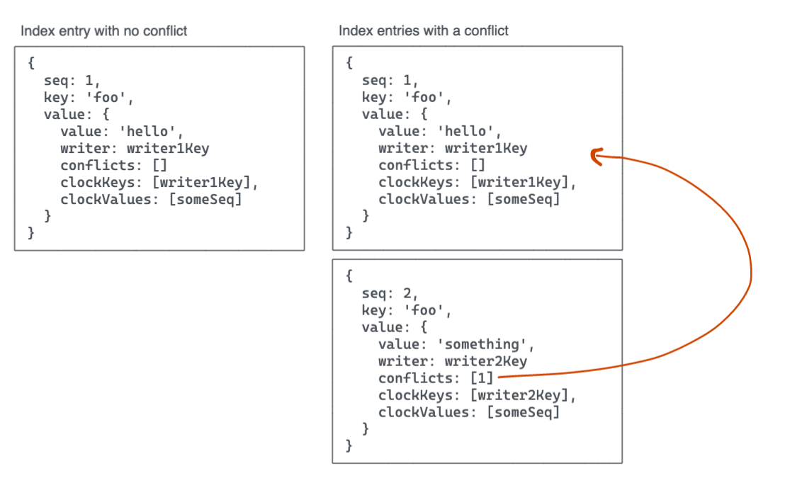

# Autobee

**This is an experiment and should not be used yet!**

A multiwriter Hyperbee comprised of multiple input Hyperbees using Autobase and Hypercore 10 (all alpha software).

- [x] Merge clock/conflict meta into index entries, either by wrapping the values or modifying hyperbee's node schema
- [x] Optimize the meta entries to not store the conflicting values (point to past index entries with other values and use index history to fetch)
- [ ] Optimize clocks when written, if possible (try to remove keys)
- [ ] Remove clocks from oplogs as they appear to be redundant
- [ ] Remove "writer" from the IndexWrapper? It's not necessary but it may be helpful metadata for apps.
- [ ] Switch the oplog to a self-describing format like msgpack?
- [ ] Implement sub() and clean up code generally
- [ ] Get fuzzer working (waiting on https://github.com/hypercore-protocol/autobase/issues/7)

```js
import Corestore from 'corestore'
import ram from 'random-access-memory'
import Autobee from 'autobee' // not actually published

const store = new Corestore(ram)
const writer1 = store.get({ name: 'writer1' })
const writer2 = store.get({ name: 'writer2' })
const index = store.get({ name: 'index' })

await writer1.ready()
await writer2.ready()

const autobee = new Autobee({inputs: [writer1, writer2], defaultInput: writer1, indexes: index})
await autobee.ready()

await autobee.put('a', 'writer1')
await autobee.put('b', 'writer1')
await autobee.get('a') => // {value: 'writer1', ...}
await autobee.get('b') => // {value: 'writer1', ...}

await autobee.put('a', 'writer2', {writer: writer2})
await autobee.put('b', 'writer2', {writer: writer2})
await autobee.get('a') => // {value: 'writer2', ...}
await autobee.get('b') => // {value: 'writer2', ...}
```

See the examples folder for more.

## Implementation

Each writer is hypercore which acts as an "operations log" which notes the puts and deletes of each writer. The Autobee uses an Autobase where the rebased-core index uses Hyperbee. Operations written to the writer oplogs are then indexed into the Hyperbee, which represents the current state.

Each Hyperbee entry's value is wrapped in the following schema:

```
value: buffer            // the actual value written
writer: buffer           // the key of the writer (TODO: needed?)
conflicts: array<uint>   // list of index hyperbee sequences where conflicts are
clockKeys: array<buffer> // the keys of the clock of this write
clockValues: array<uint> // the seq-number values of the clock of this write
```

When indexing a write, Autobee pulls the current value from the Hyperbee. It also reads the Hyperbee's *historic* values for each of the `conflicts` entries. This gives it an array of written values and their vector-clocks at the time of writing. Autobee then filters the array against the new write's vector clock, removing any entries which are no longer in conflict, then writes the new write along with a `conflicts` value which includes the sequence numbers of all entries that are still in conflict.

Here's a diagram to help illustrate:



Because the conflict-tracking metadata is stored in the Hyperbee's nodes, there is no way to track conflicts for deletes. This means that deletes always use a (deterministic) Last-Writer-Wins and cannot surface conflicting writes.

## Limitations

### Transactional batches

This Autobee does not currently support transactional batches. To support that, we need to understand how batches should handle conflicts. Should the entire batch be placed in a conflict state, or the individual KVs within a batch?

### Delete conflicts

This Autobee does not track conflicts for deletes and instead uses "Last Writer Wins" behavior for all deletes. This is because Hyperbee's del operation drops the KV node from its index, making it impossible to fetch the current clock/conflict metadata for a given KV.

To add delete conflict tracking, clock/conflict metadata would need to be written to a separate part of the Hyperbee, i.e. in a specially-designated `sub()`. This would cause all operations to create 2 blocks in the Hyperbee's core and would lead to unbounded growth of the metadata entries.

The approach currently used is more efficient. The loss of conflict visibility can be mitigated by two techniques:

- Check the history of the Hyperbee, as it will note all writes.
- Use `put(key, null)` instead of `del(key)` and then treat null values as deletions (meaning your app would filter them out manually).

## License

MIT